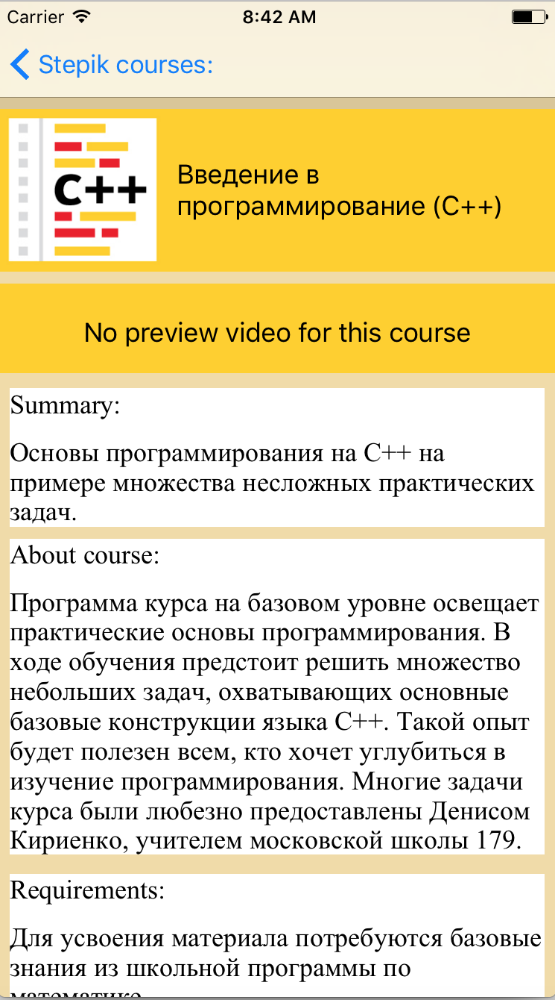
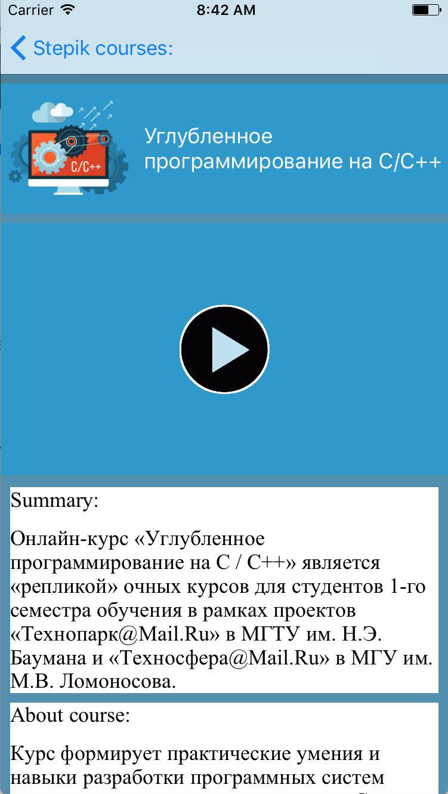
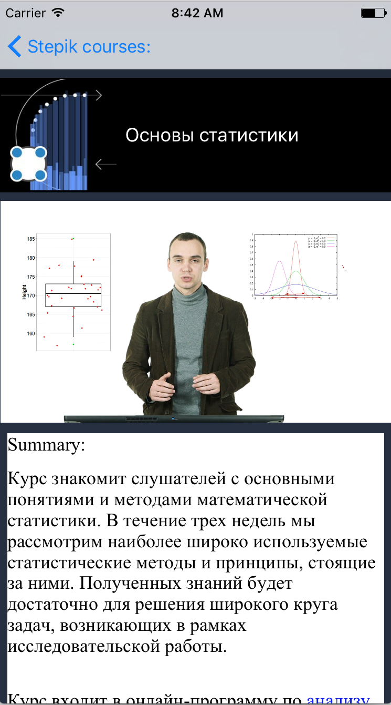
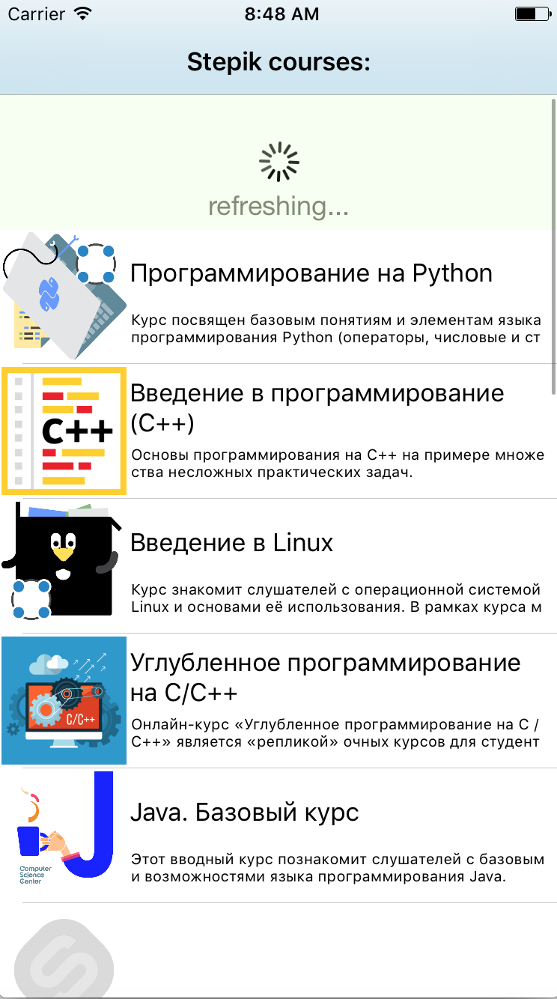
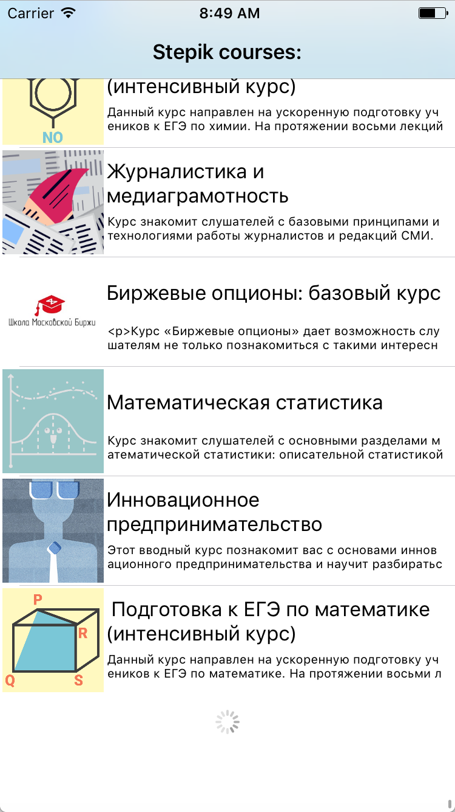
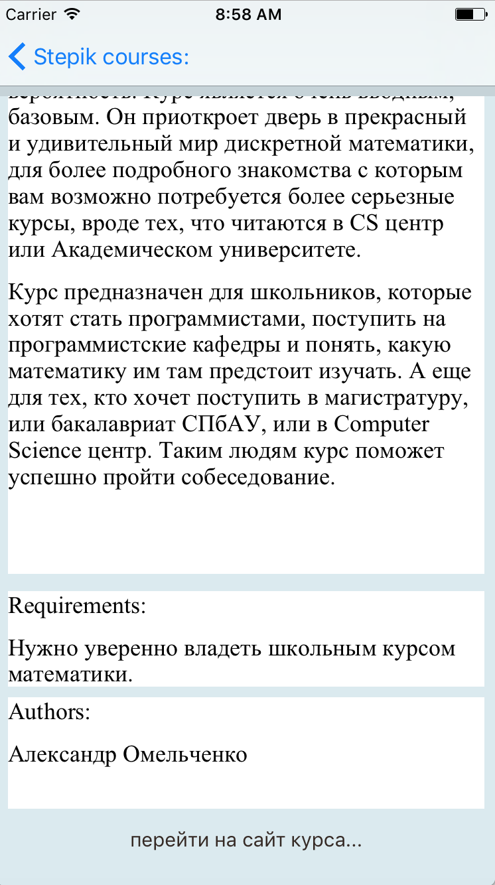

# StepikCourses

## Features:

### 1. Smart multiple level data cahing:
Setver(JSON) -> User Defaults -> RAM (Dictionary)

### 2. Unique design for eash course:
Background and font colors are based on the average color of a course logo

### 3. Pull to refresh

### 4. Infinite scrolling

### 5. Video Playing

### 6. Multiple info and site link for each course

