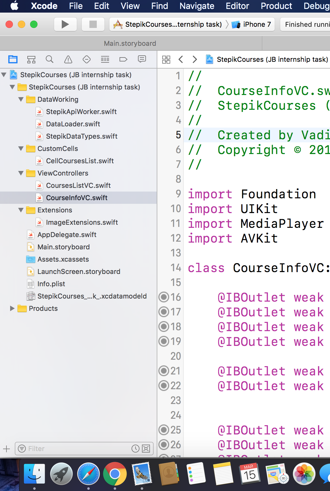

# StepikCourses

## Features:

### 1. Smart multiple level data cahing:
Sever(JSON) -> User Defaults -> RAM (Dictionary)

### 2. Lazy image loading

Asynchronous requests and Dispatch Queues usage in order to make images be placed in the table view when their downloading is complete.

### 3. Unique design for eash course:
Background and font colors are based on the average color of a course logo

### 4. Pull to refresh

### 5. Infinite scrolling

### 6. Video Playing.

### 7. Multiple info and site link for each course:

### 8. Handy app architecture:

### 9. Autolayout

The app is compatible with all of ios devices with their unique screen scale 

## TODO :

### 1. Searching courses
### 2. Video playing optimizations
### 3. Fix some small bugs
